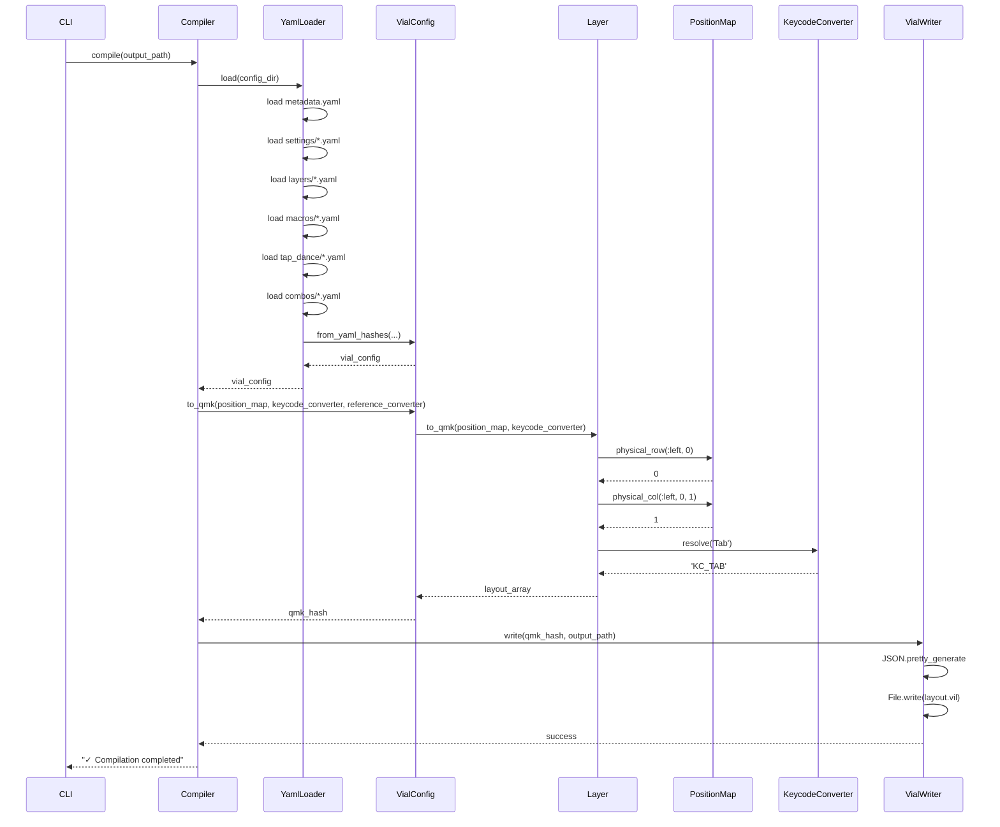
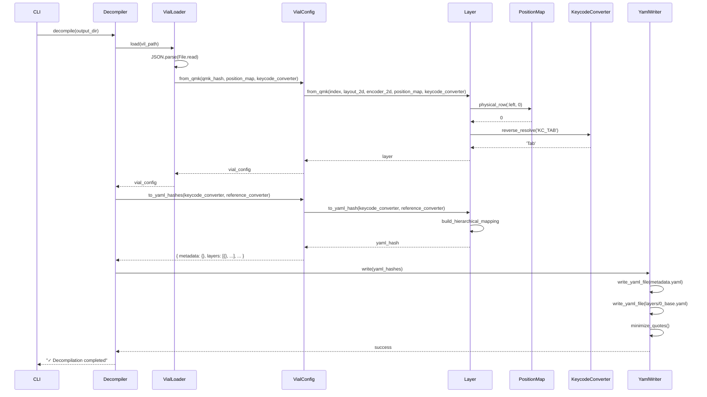

# データフロー設計

## 概要

Cornix Compiler/Decompiler のデータ変換フローを詳細に記述します。

## Compile フロー（YAML → layout.vil）

### シーケンス図



### ステップ詳細

#### Step 1: YAML読み込み（YamlLoader）

```ruby
# lib/cornix/loaders/yaml_loader.rb
def load
  metadata_hash = YAML.load_file("#{@config_dir}/metadata.yaml")
  settings_hash = YAML.load_file("#{@config_dir}/settings/qmk_settings.yaml")

  layers_hashes = Dir.glob("#{@config_dir}/layers/*.yaml").sort.map { |f|
    YAML.load_file(f)
  }

  macros_hashes = Dir.glob("#{@config_dir}/macros/*.yaml").sort.map { |f|
    YAML.load_file(f)
  }

  # ... tap_dance, combos も同様

  VialConfig.from_yaml_hashes(
    metadata_hash: metadata_hash,
    settings_hash: settings_hash,
    layers_hashes: layers_hashes,
    macros_hashes: macros_hashes,
    tap_dances_hashes: tap_dances_hashes,
    combos_hashes: combos_hashes,
    position_map: @position_map,
    keycode_converter: @keycode_converter,
    reference_converter: @reference_converter
  )
end
```

**入力例**:
```yaml
# config/layers/0_base.yaml
name: Base Layer
description: Default QWERTY layout
mapping:
  left_hand:
    row0: [Tab, Q, W, E, R, T]
    row1: [Caps, A, S, D, F, G]
    # ...
```

#### Step 2: VialConfig生成

```ruby
# lib/cornix/models/vial_config.rb
def self.from_yaml_hashes(...)
  metadata = Metadata.from_yaml_hash(metadata_hash)
  settings = Settings.from_yaml_hash(settings_hash)

  layers = LayerCollection.new(
    layers_hashes.map.with_index { |hash, idx|
      Layer.from_yaml_hash(hash, position_map)
    }
  )

  # ... macros, tap_dances, combos も同様

  new(
    metadata: metadata,
    settings: settings,
    layers: layers,
    macros: macros,
    tap_dances: tap_dances,
    combos: combos
  )
end
```

#### Step 3: QMK Hash生成（VialConfig → Layer）

```ruby
# lib/cornix/models/vial_config.rb
def to_qmk(position_map:, keycode_converter:, reference_converter:)
  {
    'version' => @metadata.version,
    'uid' => @metadata.uid,
    # ...
    'layout' => @layers.to_qmk_array(
      position_map: position_map,
      keycode_converter: keycode_converter
    ),
    # ...
  }
end

# lib/cornix/models/layer_collection.rb
def to_qmk_array(position_map:, keycode_converter:)
  Array.new(MAX_SIZE) do |i|
    if @layers[i]
      @layers[i].to_qmk(
        position_map: position_map,
        keycode_converter: keycode_converter
      )['layout']
    else
      Array.new(8) { Array.new(7, -1) }
    end
  end
end

# lib/cornix/models/layer.rb
def to_qmk(position_map:, keycode_converter:)
  {
    'layout' => build_layout_array(position_map, keycode_converter),
    'encoder_layout' => build_encoder_array(keycode_converter)
  }
end
```

**物理座標変換**:
```ruby
# lib/cornix/models/layer.rb (private method)
def build_layout_array(position_map, keycode_converter)
  layout = Array.new(8) { Array.new(7, -1) }

  # 左手 row0
  @left_hand.row0.each do |key_mapping|
    coord = key_mapping.logical_coord  # { hand: :left, row: 0, col: 1 }
    phys_row = position_map.physical_row(:left, coord[:row])  # → 0
    phys_col = position_map.physical_col(:left, coord[:row], coord[:col])  # → 1
    layout[phys_row][phys_col] = keycode_converter.resolve(key_mapping.keycode)
    # 'Tab' → 'KC_TAB'
  end

  # ... 右手、親指キー、エンコーダー も同様

  layout
end
```

**出力例**:
```ruby
# QMK Hash
{
  'version' => 5,
  'uid' => 'ABC123',
  'layout' => [
    [  # Layer 0
      [1049, 20, 26, ...],  # Row 0 (物理座標)
      # ... Row 1-7
    ],
    # ... Layer 1-9
  ],
  'encoder_layout' => [ ... ],
  'macro' => [ ... ],
  # ...
}
```

#### Step 4: JSON書き込み（VialWriter）

```ruby
# lib/cornix/writers/vial_writer.rb
def write(qmk_hash, output_path)
  json_str = JSON.pretty_generate(qmk_hash)
  File.write(output_path, json_str)
end
```

**出力ファイル**: `layout.vil` (JSON形式)

---

## Decompile フロー（layout.vil → YAML）

### シーケンス図



### ステップ詳細

#### Step 1: JSON読み込み（VialLoader）

```ruby
# lib/cornix/loaders/vial_loader.rb
def load(position_map:, keycode_converter:)
  json_str = File.read(@vil_path)
  qmk_hash = JSON.parse(json_str)

  VialConfig.from_qmk(
    qmk_hash,
    position_map: position_map,
    keycode_converter: keycode_converter
  )
end
```

**入力例**:
```json
{
  "version": 5,
  "uid": "ABC123",
  "layout": [
    [[1049, 20, 26, ...], ...],
    ...
  ],
  "encoder_layout": [...],
  "macro": [[], [1, 2, 3], ...],
  ...
}
```

#### Step 2: VialConfig生成

```ruby
# lib/cornix/models/vial_config.rb
def self.from_qmk(qmk_hash, position_map:, keycode_converter:)
  metadata = Metadata.from_qmk(qmk_hash)
  settings = Settings.from_qmk(qmk_hash['settings'])

  layers = LayerCollection.new(
    qmk_hash['layout'].map.with_index { |layout_2d, idx|
      encoder_2d = qmk_hash['encoder_layout'][idx]
      Layer.from_qmk(idx, layout_2d, encoder_2d, position_map, keycode_converter)
    }
  )

  # ... macros, tap_dances, combos も同様

  new(
    metadata: metadata,
    settings: settings,
    layers: layers,
    macros: macros,
    tap_dances: tap_dances,
    combos: combos
  )
end
```

#### Step 3: Layer生成（物理座標 → 論理座標）

```ruby
# lib/cornix/models/layer.rb
def self.from_qmk(index, layout_2d, encoder_2d, position_map, keycode_converter)
  left_hand = build_left_hand_mapping(layout_2d, position_map, keycode_converter)
  right_hand = build_right_hand_mapping(layout_2d, position_map, keycode_converter)
  encoders = build_encoder_mapping(layout_2d, encoder_2d, position_map, keycode_converter)

  new(
    name: "Layer #{index}",  # デフォルト名
    description: '',
    index: index,
    left_hand: left_hand,
    right_hand: right_hand,
    encoders: encoders
  )
end

def self.build_left_hand_mapping(layout_2d, position_map, keycode_converter)
  row0_keys = []

  # position_map から論理シンボルを取得
  position_map.left_hand_row0_symbols.each_with_index do |symbol, logical_col|
    phys_row = position_map.physical_row(:left, 0)
    phys_col = position_map.physical_col(:left, 0, logical_col)
    qmk_keycode = layout_2d[phys_row][phys_col]

    next if qmk_keycode == -1

    alias_keycode = keycode_converter.reverse_resolve(qmk_keycode)
    # 'KC_TAB' → 'Tab'

    row0_keys << KeyMapping.new(
      symbol: symbol,
      keycode: alias_keycode,
      logical_coord: { hand: :left, row: 0, col: logical_col }
    )
  end

  # ... row1-3, thumb_keys も同様

  LeftHandMapping.new(
    row0: row0_keys,
    row1: row1_keys,
    row2: row2_keys,
    row3: row3_keys,
    thumb_keys: thumb_keys
  )
end
```

#### Step 4: YAML Hash生成

```ruby
# lib/cornix/models/vial_config.rb
def to_yaml_hashes(keycode_converter:, reference_converter:)
  {
    metadata: @metadata.to_yaml_hash,
    settings: @settings.to_yaml_hash,
    layers: @layers.map { |layer|
      layer.to_yaml_hash(
        keycode_converter: keycode_converter,
        reference_converter: reference_converter
      )
    },
    macros: @macros.map { |macro| macro.to_yaml_hash },
    tap_dances: @tap_dances.map { |td| td.to_yaml_hash },
    combos: @combos.map { |combo| combo.to_yaml_hash }
  }
end

# lib/cornix/models/layer.rb
def to_yaml_hash(keycode_converter:, reference_converter:)
  {
    'name' => @name,
    'description' => @description,
    'mapping' => build_hierarchical_mapping(keycode_converter, reference_converter)
  }
end

def build_hierarchical_mapping(keycode_converter, reference_converter)
  {
    'left_hand' => {
      'row0' => @left_hand.row0.map { |km| km.keycode },
      'row1' => @left_hand.row1.map { |km| km.keycode },
      # ...
      'thumb_keys' => @left_hand.thumb_keys.map { |km| km.keycode }
    },
    'right_hand' => {
      # ... 同様
    },
    'encoders' => {
      'left' => @encoders.left,
      'right' => @encoders.right
    }
  }
end
```

**出力例**:
```ruby
# YAML Hash (layers)
[
  {
    'name' => 'Layer 0',
    'description' => '',
    'mapping' => {
      'left_hand' => {
        'row0' => ['Tab', 'Q', 'W', 'E', 'R', 'T'],
        'row1' => ['Caps', 'A', 'S', 'D', 'F', 'G'],
        # ...
      },
      # ...
    }
  },
  # ... Layer 1-9
]
```

#### Step 5: YAML書き込み（YamlWriter）

```ruby
# lib/cornix/writers/yaml_writer.rb
def write(yaml_hashes)
  write_yaml_file("#{@output_dir}/metadata.yaml", yaml_hashes[:metadata])
  write_yaml_file("#{@output_dir}/settings/qmk_settings.yaml", yaml_hashes[:settings])

  yaml_hashes[:layers].each_with_index do |layer_hash, idx|
    filename = "#{idx}_#{layer_hash['name'].downcase.tr(' ', '_')}.yaml"
    write_yaml_file("#{@output_dir}/layers/#{filename}", layer_hash)
  end

  # ... macros, tap_dances, combos も同様
end

def write_yaml_file(path, hash)
  yaml_str = YAML.dump(hash)
  yaml_str = minimize_quotes(yaml_str)  # クォート最適化
  File.write(path, yaml_str)
end
```

**出力ファイル**:
```
config/
├── metadata.yaml
├── settings/qmk_settings.yaml
├── layers/
│   ├── 0_base.yaml
│   ├── 1_symbols.yaml
│   └── ...
├── macros/
│   ├── 00_macro.yaml
│   └── ...
├── tap_dance/
└── combos/
```

---

## データ形式変換例

### Layer 変換の詳細

#### YAML → 論理モデル → QMK物理配列

```
YAML:
  left_hand:
    row0: [Tab, Q, W, E, R, T]

↓ from_yaml_hash()

Layer (論理モデル):
  left_hand:
    row0: [
      KeyMapping(symbol: 'tab', keycode: 'Tab', logical_coord: {hand: :left, row: 0, col: 0}),
      KeyMapping(symbol: 'Q', keycode: 'Q', logical_coord: {hand: :left, row: 0, col: 1}),
      ...
    ]

↓ to_qmk(position_map, keycode_converter)

QMK 物理配列:
  layout[0][0] = 1049  # KC_TAB (phys_row=0, phys_col=0)
  layout[0][1] = 20    # KC_Q (phys_row=0, phys_col=1)
  ...
```

#### QMK物理配列 → 論理モデル → YAML

```
QMK 物理配列:
  layout[0][0] = 1049  # KC_TAB

↓ from_qmk(layout_2d, position_map, keycode_converter)

Layer (論理モデル):
  left_hand:
    row0: [
      KeyMapping(symbol: 'tab', keycode: 'Tab', logical_coord: {hand: :left, row: 0, col: 0})
    ]

↓ to_yaml_hash(keycode_converter, reference_converter)

YAML:
  left_hand:
    row0: [Tab, Q, W, E, R, T]
```

### Macro 変換例

```
QMK:
  macro[3] = [1, 2, 3, 4, 0]  # 整数配列

↓ from_qmk(3, [1, 2, 3, 4, 0])

Macro (モデル):
  index: 3
  name: "Macro 3"  # デフォルト名
  description: ""
  sequence: [1, 2, 3, 4, 0]

↓ to_yaml_hash()

YAML:
  index: 3
  name: "End of Line"  # YamlLoaderで名前を更新可能
  description: "Jump to end of line"
  sequence: [1, 2, 3, 4, 0]

↓ to_qmk()

QMK:
  macro[3] = [1, 2, 3, 4, 0]  # 整数配列（同じ）
```

---

## 座標変換の流れ

### Compile時（論理 → 物理）

```
1. YAML読み込み
   mapping.left_hand.row0[1] = 'Q'  # 論理位置: row0, col 1

2. Layer.from_yaml_hash()
   KeyMapping(
     symbol: 'Q',
     keycode: 'Q',
     logical_coord: { hand: :left, row: 0, col: 1 }
   )

3. Layer.build_layout_array()
   phys_row = position_map.physical_row(:left, 0)  # → 0
   phys_col = position_map.physical_col(:left, 0, 1)  # → 1
   qmk_keycode = keycode_converter.resolve('Q')  # → 'KC_Q'
   layout[0][1] = 'KC_Q'  # 物理位置に配置
```

### Decompile時（物理 → 論理）

```
1. JSON読み込み
   layout[0][1] = 20  # 物理位置: row 0, col 1

2. Layer.from_qmk()
   # position_map の論理シンボル順でループ
   position_map.left_hand_row0_symbols[1] = 'Q'  # 論理位置
   phys_row = position_map.physical_row(:left, 0)  # → 0
   phys_col = position_map.physical_col(:left, 0, 1)  # → 1
   qmk_keycode = layout[0][1]  # → 20
   alias_keycode = keycode_converter.reverse_resolve(20)  # → 'Q'

   KeyMapping(
     symbol: 'Q',
     keycode: 'Q',
     logical_coord: { hand: :left, row: 0, col: 1 }
   )

3. Layer.to_yaml_hash()
   mapping.left_hand.row0[1] = 'Q'  # 論理位置に復元
```

---

## エラーハンドリング

### Compile時のエラー

```ruby
# YamlLoader
begin
  YAML.load_file(path)
rescue Psych::SyntaxError => e
  raise CompileError, "Invalid YAML syntax in #{path}: #{e.message}"
end

# Layer.from_yaml_hash()
raise ArgumentError, "Missing required field: mapping.left_hand" unless yaml_hash['mapping']['left_hand']

# KeycodeConverter.resolve()
raise KeycodeError, "Unknown keycode: #{keycode}" unless @qmk_map[keycode]
```

### Decompile時のエラー

```ruby
# VialLoader
begin
  JSON.parse(json_str)
rescue JSON::ParserError => e
  raise DecompileError, "Invalid JSON in #{@vil_path}: #{e.message}"
end

# Layer.from_qmk()
raise ArgumentError, "Invalid layout dimensions: expected 8x7, got #{layout_2d.size}x#{layout_2d[0].size}"

# KeycodeConverter.reverse_resolve()
# エイリアスが見つからない場合は QMK形式のまま返す（エラーにしない）
return "KC_#{qmk_keycode}" unless @reverse_map[qmk_keycode]
```

---

## 次のステップ

- [coordinate_system.md](coordinate_system.md): 座標変換システムの詳細
- [migration_guide.md](migration_guide.md): 実装ガイド
