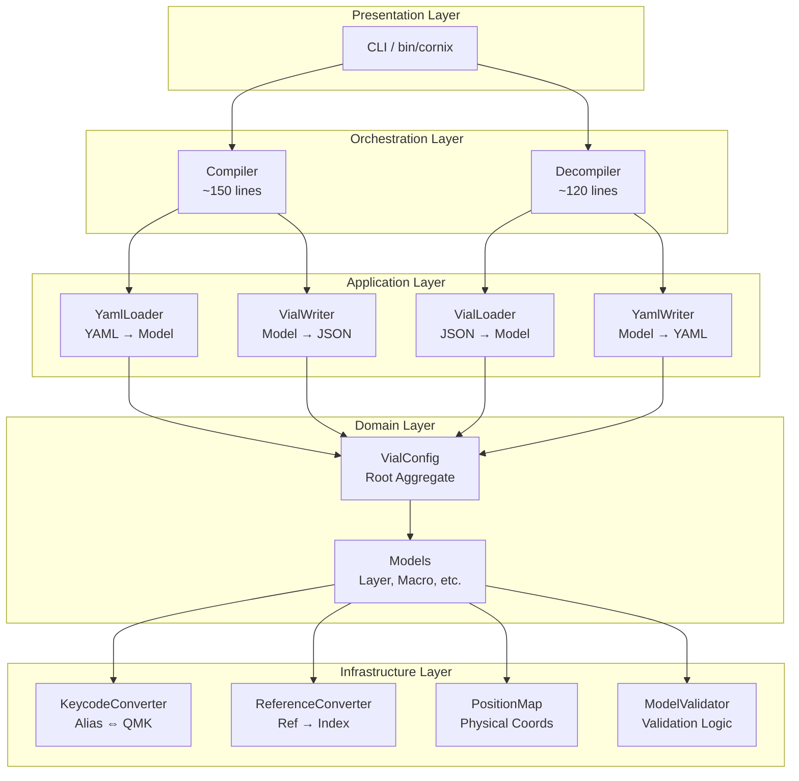
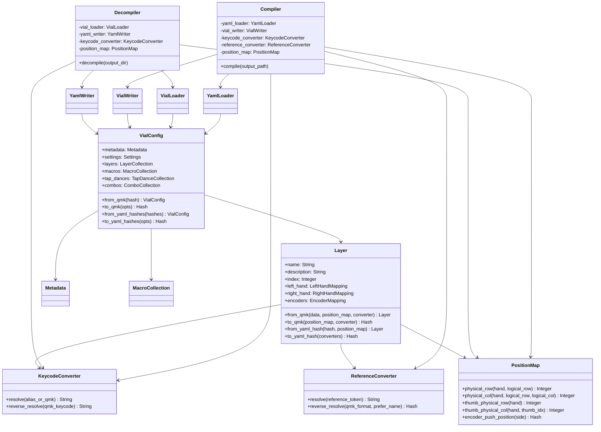

# アーキテクチャ設計

## システム概要

Cornix Compiler/Decompiler の新アーキテクチャは、責務の明確な分離とモデル中心の設計を採用します。

## レイヤー構造



## モジュール間依存関係



## 責務の分離

### 1. Orchestration Layer（オーケストレーション層）

**責務**: 全体のフロー制御、各コンポーネントの呼び出し順序管理

**コンポーネント**:
- `Compiler`: YAML → VialConfig → JSON のフロー管理
- `Decompiler`: JSON → VialConfig → YAML のフロー管理

**特徴**:
- ビジネスロジックを持たない（全てモデルに委譲）
- 薄いラッパー（~150行、~120行）

### 2. Application Layer（アプリケーション層）

**責務**: データの読み書き、ファイルI/O

**コンポーネント**:
- `VialLoader`: layout.vil（JSON）を読み込み、VialConfigを生成
- `YamlLoader`: config/*.yaml を読み込み、VialConfigを生成
- `VialWriter`: VialConfigからlayout.vil（JSON）を生成
- `YamlWriter`: VialConfigからconfig/*.yamlを生成

**特徴**:
- ファイルI/Oに特化
- データ変換ロジックはモデルに委譲

### 3. Domain Layer（ドメイン層）

**責務**: ビジネスロジック、データ変換、モデル表現

**コンポーネント**:
- `VialConfig`: Root Aggregate（全エンティティの集約）
- `Layer`, `Macro`, `TapDance`, `Combo`: エンティティモデル
- `LayerCollection`, `MacroCollection`, etc.: コレクション（固定サイズ配列のラッパー）

**特徴**:
- `to_qmk()`, `to_yaml_hash()` メソッドで自己変換
- `from_qmk()`, `from_yaml_hash()` ファクトリーメソッドで生成
- 型安全な構造（PORO）

### 4. Infrastructure Layer（インフラ層）

**責務**: 共通ユーティリティ、座標変換、検証

**コンポーネント**:
- `PositionMap`: 論理座標 ↔ 物理座標の変換
- `KeycodeConverter`: エイリアス ↔ QMKキーコードの変換
- `ReferenceConverter`: Macro('name') ↔ M3 の変換
- `ModelValidator`: モデルの妥当性検証

**特徴**:
- 横断的関心事
- モデルから参照される（依存性逆転）

## 新旧アーキテクチャの比較

| 観点 | 旧アーキテクチャ | 新アーキテクチャ |
|------|----------------|----------------|
| **コード行数** | Compiler 554行, Decompiler 767行 | Compiler 150行, Decompiler 120行 |
| **責務** | 1クラスに全責務混在 | レイヤー別に分離 |
| **データ表現** | 多次元配列（型なし） | POROモデル（型安全） |
| **座標計算** | 16箇所に散在 | PositionMapに集約 |
| **重複コード** | detect_left/right_hand_diff (120行) | Layerモデルで統一 |
| **テスト** | 結合テスト中心（85テスト） | ユニットテスト中心（80テスト）+ 結合（20テスト） |
| **変更容易性** | 影響範囲が広い | 影響範囲が限定的 |
| **拡張性** | 新エンティティ追加が困難 | パターン化されており容易 |

## データフロー概要

### Compile フロー

```
config/*.yaml
    ↓ YamlLoader
VialConfig (モデル)
    ↓ to_qmk()
QMK Hash
    ↓ VialWriter
layout.vil (JSON)
```

### Decompile フロー

```
layout.vil (JSON)
    ↓ VialLoader
VialConfig (モデル)
    ↓ to_yaml_hashes()
YAML Hash群
    ↓ YamlWriter
config/*.yaml
```

## 設計原則

### 1. Plain Old Ruby Object (PORO)

- Structやdry-typesに依存しない
- 明示的なattr_readerとinitialize
- 他言語への移植を考慮

### 2. Rich Domain Model

- モデル自身が変換ロジックを持つ
- `to_qmk()`, `to_yaml_hash()` による自己変換
- Anemic Domain Model を避ける

### 3. 依存性逆転の原則

- ドメイン層がインフラ層に依存しない
- インフラ層をモデルに注入（DI）
- PositionMap, Converter はインターフェース的に使用

### 4. 単一責務の原則

- 1クラス1責務
- Compilerはオーケストレーションのみ
- Loaderはファイル読み込みのみ

### 5. 開放閉鎖の原則

- 新エンティティ追加時、既存コードを変更しない
- パターンの統一（Macro, TapDance, Comboは同じ構造）

## 実装制約

### MUST（必須）

- Plain Ruby のみ使用（標準ライブラリ、既存の yaml, json のみ許可）
- 外部 gem 依存を追加しない
- メタプログラミング（`define_method`, `method_missing`, `class_eval` 等）を避ける
- 明示的なコード記述（他言語への移植を考慮）

### AVOID（回避）

- `send(:method_name)` による動的メソッド呼び出し
- DSL 的な記法
- Ruby 特有のイディオム（過度な Symbol、ブロック多用）

## ファイル構成

```
lib/cornix/
├── models/                      # Domain Layer
│   ├── vial_config.rb          # Root aggregate
│   ├── metadata.rb
│   ├── settings.rb
│   ├── layer.rb                # with inner classes
│   ├── layer_collection.rb
│   ├── macro.rb
│   ├── macro_collection.rb
│   ├── tap_dance.rb
│   ├── tap_dance_collection.rb
│   ├── combo.rb
│   └── combo_collection.rb
├── loaders/                     # Application Layer (Input)
│   ├── vial_loader.rb
│   ├── yaml_loader.rb
│   └── loader_helpers.rb
├── writers/                     # Application Layer (Output)
│   ├── vial_writer.rb
│   ├── yaml_writer.rb
│   └── writer_helpers.rb
├── converters/                  # Infrastructure Layer
│   ├── keycode_converter.rb
│   └── reference_converter.rb
├── validators/                  # Infrastructure Layer
│   └── model_validator.rb
├── compiler.rb                  # Orchestration Layer
├── decompiler.rb                # Orchestration Layer
└── position_map.rb              # Infrastructure Layer (enhanced)
```

## 次のステップ

- [models.md](models.md): モデルの詳細設計
- [data_flow.md](data_flow.md): データ変換フローの詳細
- [coordinate_system.md](coordinate_system.md): 座標変換システム
- [migration_guide.md](migration_guide.md): 実装ガイド
