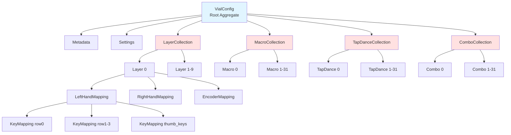
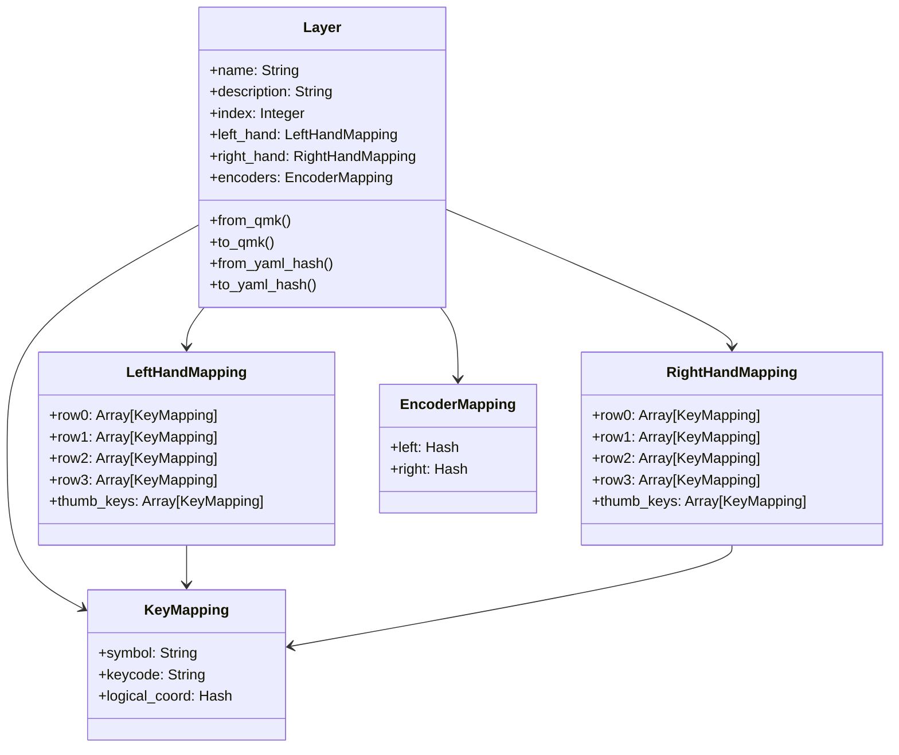
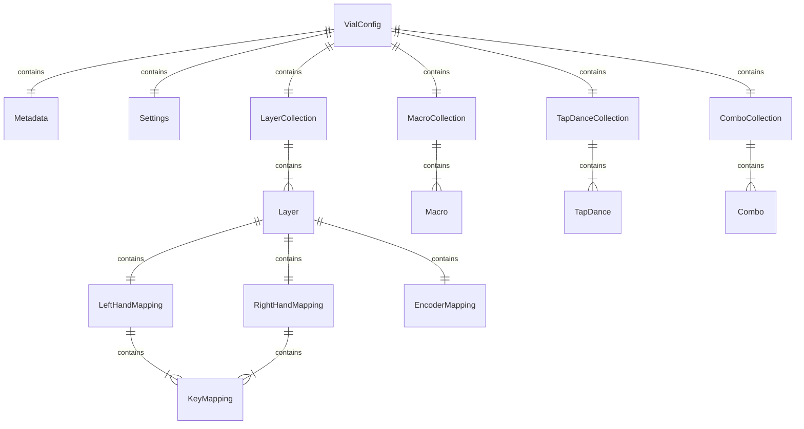

# モデル設計詳細

## モデル階層構造



## VialConfig（Root Aggregate）

### 責務

- 全エンティティの集約
- QMK形式 ↔ YAML形式の最上位変換

### クラス定義

```ruby
module Cornix
  module Models
    class VialConfig
      attr_reader :metadata, :settings, :layers, :macros, :tap_dances, :combos

      def initialize(metadata:, settings:, layers:, macros:, tap_dances:, combos:)
        @metadata = metadata        # Metadata
        @settings = settings        # Settings
        @layers = layers           # LayerCollection (10 layers)
        @macros = macros           # MacroCollection (32 macros)
        @tap_dances = tap_dances   # TapDanceCollection (32 tap dances)
        @combos = combos           # ComboCollection (32 combos)
      end

      # QMK Hash → VialConfig
      def self.from_qmk(qmk_hash, position_map:, keycode_converter:)
        # ...
      end

      # VialConfig → QMK Hash
      def to_qmk(position_map:, keycode_converter:, reference_converter:)
        {
          'version' => @metadata.version,
          'uid' => @metadata.uid,
          'vendor_product_id' => @metadata.vendor_product_id,
          'product_id' => @metadata.product_id,
          'matrix' => @metadata.matrix,
          'vial_protocol' => @metadata.vial_protocol,
          'via_protocol' => @metadata.via_protocol,
          'layout' => @layers.to_qmk_array(
            position_map: position_map,
            keycode_converter: keycode_converter
          ),
          'encoder_layout' => @layers.encoder_to_qmk_array(
            keycode_converter: keycode_converter
          ),
          'macro' => @macros.to_qmk_array,
          'tap_dance' => @tap_dances.to_qmk_array,
          'combo' => @combos.to_qmk_array,
          'settings' => @settings.to_qmk
        }
      end

      # 複数の YAML Hash → VialConfig
      def self.from_yaml_hashes(
        metadata_hash:,
        settings_hash:,
        layers_hashes:,
        macros_hashes:,
        tap_dances_hashes:,
        combos_hashes:,
        position_map:,
        keycode_converter:,
        reference_converter:
      )
        # ...
      end

      # VialConfig → 複数の YAML Hash
      def to_yaml_hashes(keycode_converter:, reference_converter:)
        {
          metadata: @metadata.to_yaml_hash,
          settings: @settings.to_yaml_hash,
          layers: @layers.map { |layer|
            layer.to_yaml_hash(
              keycode_converter: keycode_converter,
              reference_converter: reference_converter
            )
          },
          macros: @macros.map { |macro| macro.to_yaml_hash },
          tap_dances: @tap_dances.map { |td| td.to_yaml_hash },
          combos: @combos.map { |combo| combo.to_yaml_hash }
        }
      end
    end
  end
end
```

---

## Metadata

### 責務

- キーボードメタデータの保持
- QMK形式 ↔ YAML形式の変換

### クラス定義

```ruby
module Cornix
  module Models
    class Metadata
      attr_reader :keyboard, :version, :uid, :vendor_product_id, :product_id,
                  :matrix, :vial_protocol, :via_protocol

      def initialize(
        keyboard:,
        version:,
        uid:,
        vendor_product_id:,
        product_id:,
        matrix:,
        vial_protocol:,
        via_protocol:
      )
        @keyboard = keyboard
        @version = version
        @uid = uid
        @vendor_product_id = vendor_product_id
        @product_id = product_id
        @matrix = matrix  # { 'rows' => 8, 'cols' => 7 }
        @vial_protocol = vial_protocol
        @via_protocol = via_protocol
      end

      def self.from_qmk(hash)
        new(
          keyboard: 'Cornix',  # 固定値（QMKには含まれない）
          version: hash['version'],
          uid: hash['uid'],
          vendor_product_id: hash['vendor_product_id'],
          product_id: hash['product_id'],
          matrix: hash['matrix'],
          vial_protocol: hash['vial_protocol'],
          via_protocol: hash['via_protocol']
        )
      end

      def to_qmk
        {
          'version' => @version,
          'uid' => @uid,
          'vendor_product_id' => @vendor_product_id,
          'product_id' => @product_id,
          'matrix' => @matrix,
          'vial_protocol' => @vial_protocol,
          'via_protocol' => @via_protocol
        }
      end

      def self.from_yaml_hash(hash)
        new(
          keyboard: hash['keyboard'],
          version: hash['version'],
          uid: hash['uid'],
          vendor_product_id: hash['vendor_product_id'],
          product_id: hash['product_id'],
          matrix: hash['matrix'],
          vial_protocol: hash['vial_protocol'],
          via_protocol: hash['via_protocol']
        )
      end

      def to_yaml_hash
        {
          'keyboard' => @keyboard,
          'version' => @version,
          'uid' => @uid,
          'vendor_product_id' => @vendor_product_id,
          'product_id' => @product_id,
          'matrix' => @matrix,
          'vial_protocol' => @vial_protocol,
          'via_protocol' => @via_protocol
        }
      end
    end
  end
end
```

---

## Settings

### 責務

- QMK設定の保持（透過的に扱う）

### クラス定義

```ruby
module Cornix
  module Models
    class Settings
      attr_reader :settings_hash

      def initialize(settings_hash)
        @settings_hash = settings_hash
      end

      def self.from_qmk(hash)
        new(hash)
      end

      def to_qmk
        @settings_hash
      end

      def self.from_yaml_hash(hash)
        new(hash)
      end

      def to_yaml_hash
        @settings_hash
      end
    end
  end
end
```

---

## Layer & LayerCollection

### Layer の責務

- 1つのレイヤーのキーマッピング保持
- 論理座標（シンボルベース）でデータ保持
- QMK形式 ↔ YAML形式の変換時に物理座標変換

### Layer インナークラス構造



### Layer クラス定義

```ruby
module Cornix
  module Models
    class Layer
      attr_reader :name, :description, :index, :left_hand, :right_hand, :encoders

      # インナークラス: KeyMapping
      class KeyMapping
        attr_reader :symbol, :keycode, :logical_coord

        def initialize(symbol:, keycode:, logical_coord:)
          @symbol = symbol            # 'Q', 'tab' 等
          @keycode = keycode          # 'KC_Q', 'Tab' 等
          @logical_coord = logical_coord  # { hand: :left, row: 0, col: 1 }
        end
      end

      # インナークラス: LeftHandMapping
      class LeftHandMapping
        attr_reader :row0, :row1, :row2, :row3, :thumb_keys

        def initialize(row0:, row1:, row2:, row3:, thumb_keys:)
          @row0 = row0          # Array[KeyMapping], max 6 elements
          @row1 = row1
          @row2 = row2
          @row3 = row3          # Array[KeyMapping], max 3 elements (standard grid keys)
          @thumb_keys = thumb_keys  # Array[KeyMapping], 3 elements (fixed)
        end

        def all_keys
          [*@row0, *@row1, *@row2, *@row3, *@thumb_keys]
        end
      end

      # インナークラス: RightHandMapping (構造はLeftHandMappingと同じ)
      class RightHandMapping
        attr_reader :row0, :row1, :row2, :row3, :thumb_keys

        def initialize(row0:, row1:, row2:, row3:, thumb_keys:)
          @row0 = row0
          @row1 = row1
          @row2 = row2
          @row3 = row3
          @thumb_keys = thumb_keys
        end

        def all_keys
          [*@row0, *@row1, *@row2, *@row3, *@thumb_keys]
        end
      end

      # インナークラス: EncoderMapping
      class EncoderMapping
        attr_reader :left, :right

        def initialize(left:, right:)
          @left = left    # { push: 'KC_MUTE', ccw: 'KC_VOLD', cw: 'KC_VOLU' }
          @right = right  # { push: 'KC_MPLY', ccw: 'KC_MPRV', cw: 'KC_MNXT' }
        end
      end

      def initialize(name:, description:, index:, left_hand:, right_hand:, encoders:)
        @name = name
        @description = description
        @index = index
        @left_hand = left_hand    # LeftHandMapping
        @right_hand = right_hand  # RightHandMapping
        @encoders = encoders      # EncoderMapping
      end

      # QMK 2次元配列 → Layer
      def self.from_qmk(index, layout_2d, encoder_2d, position_map, keycode_converter)
        # build_left_hand_mapping, build_right_hand_mapping を呼び出す
        # ...
      end

      # Layer → QMK Hash
      def to_qmk(position_map:, keycode_converter:)
        {
          'layout' => build_layout_array(position_map, keycode_converter),
          'encoder_layout' => build_encoder_array(keycode_converter)
        }
      end

      # YAML Hash → Layer
      def self.from_yaml_hash(yaml_hash, position_map)
        # ...
      end

      # Layer → YAML Hash
      def to_yaml_hash(keycode_converter:, reference_converter:)
        {
          'name' => @name,
          'description' => @description,
          'mapping' => build_hierarchical_mapping(keycode_converter, reference_converter)
        }
      end

      private

      # 8行×7列の物理配列を構築（PositionMapを使用）
      def build_layout_array(position_map, keycode_converter)
        layout = Array.new(8) { Array.new(7, -1) }

        # 左手 row0-3
        [@left_hand.row0, @left_hand.row1, @left_hand.row2, @left_hand.row3].each do |row|
          row.each do |key_mapping|
            coord = key_mapping.logical_coord
            phys_row = position_map.physical_row(:left, coord[:row])
            phys_col = position_map.physical_col(:left, coord[:row], coord[:col])
            layout[phys_row][phys_col] = keycode_converter.resolve(key_mapping.keycode)
          end
        end

        # 右手 row0-3（PositionMapで逆順処理が隠蔽される）
        [@right_hand.row0, @right_hand.row1, @right_hand.row2, @right_hand.row3].each do |row|
          row.each do |key_mapping|
            coord = key_mapping.logical_coord
            phys_row = position_map.physical_row(:right, coord[:row])
            phys_col = position_map.physical_col(:right, coord[:row], coord[:col])
            layout[phys_row][phys_col] = keycode_converter.resolve(key_mapping.keycode)
          end
        end

        # 親指キー（PositionMapのthumb_physical_row/colを使用）
        @left_hand.thumb_keys.each_with_index do |key_mapping, idx|
          phys_row = position_map.thumb_physical_row(:left)
          phys_col = position_map.thumb_physical_col(:left, idx)
          layout[phys_row][phys_col] = keycode_converter.resolve(key_mapping.keycode)
        end

        @right_hand.thumb_keys.each_with_index do |key_mapping, idx|
          phys_row = position_map.thumb_physical_row(:right)
          phys_col = position_map.thumb_physical_col(:right, idx)
          layout[phys_row][phys_col] = keycode_converter.resolve(key_mapping.keycode)
        end

        # エンコーダープッシュ（PositionMapのencoder_push_positionを使用）
        left_pos = position_map.encoder_push_position(:left)
        right_pos = position_map.encoder_push_position(:right)
        layout[left_pos[:row]][left_pos[:col]] = keycode_converter.resolve(@encoders.left[:push])
        layout[right_pos[:row]][right_pos[:col]] = keycode_converter.resolve(@encoders.right[:push])

        layout
      end

      # 2×2のエンコーダー配列を構築
      def build_encoder_array(keycode_converter)
        [
          [
            keycode_converter.resolve(@encoders.left[:ccw]),
            keycode_converter.resolve(@encoders.left[:cw])
          ],
          [
            keycode_converter.resolve(@encoders.right[:ccw]),
            keycode_converter.resolve(@encoders.right[:cw])
          ]
        ]
      end

      # 階層化YAMLハッシュを構築
      def build_hierarchical_mapping(keycode_converter, reference_converter)
        # 現在のdecompilerロジックと同様
        # ...
      end

      # 物理座標 → 論理座標 → LeftHandMapping
      def self.build_left_hand_mapping(layout_2d, position_map, keycode_converter)
        # ...
      end

      # 物理座標 → 論理座標 → RightHandMapping
      def self.build_right_hand_mapping(layout_2d, position_map, keycode_converter)
        # ...
      end
    end
  end
end
```

### LayerCollection の責務

- 10レイヤー固定のコレクション
- インデックスアクセス、反復処理のサポート

### LayerCollection クラス定義

```ruby
module Cornix
  module Models
    class LayerCollection
      MAX_SIZE = 10

      def initialize(layers = [])
        raise ArgumentError, "Too many layers: #{layers.size} (max: #{MAX_SIZE})" if layers.size > MAX_SIZE
        @layers = layers
      end

      def [](index)
        @layers[index]
      end

      def each(&block)
        @layers.each(&block)
      end

      def map(&block)
        @layers.map(&block)
      end

      def size
        @layers.size
      end

      # 10要素の配列を生成（空きは8行×7列の-1配列）
      def to_qmk_array(position_map:, keycode_converter:)
        Array.new(MAX_SIZE) do |i|
          if @layers[i]
            @layers[i].to_qmk(position_map: position_map, keycode_converter: keycode_converter)['layout']
          else
            Array.new(8) { Array.new(7, -1) }
          end
        end
      end

      # 10要素のエンコーダー配列を生成（空きは2×2の-1配列）
      def encoder_to_qmk_array(keycode_converter:)
        Array.new(MAX_SIZE) do |i|
          if @layers[i]
            @layers[i].to_qmk(position_map: nil, keycode_converter: keycode_converter)['encoder_layout']
          else
            Array.new(2) { Array.new(2, -1) }
          end
        end
      end
    end
  end
end
```

---

## Macro & MacroCollection

### Macro の責務

- 1つのマクロのシーケンス保持
- QMK形式（整数配列） ↔ YAML形式の変換

### Macro クラス定義

```ruby
module Cornix
  module Models
    class Macro
      attr_reader :index, :name, :description, :sequence

      def initialize(index:, name:, description:, sequence:)
        @index = index            # 0-31
        @name = name              # 'End of Line'
        @description = description
        @sequence = sequence      # Array[Integer] (QMK codes)
      end

      def self.from_qmk(index, qmk_array)
        new(
          index: index,
          name: "Macro #{index}",  # デフォルト名（Decompilerで上書き可能）
          description: '',
          sequence: qmk_array
        )
      end

      def to_qmk
        @sequence
      end

      def self.from_yaml_hash(yaml_hash)
        new(
          index: yaml_hash['index'],
          name: yaml_hash['name'],
          description: yaml_hash['description'] || '',
          sequence: yaml_hash['sequence']
        )
      end

      def to_yaml_hash
        {
          'index' => @index,
          'name' => @name,
          'description' => @description,
          'sequence' => @sequence
        }
      end
    end
  end
end
```

### MacroCollection の責務

- 32マクロ固定のコレクション

### MacroCollection クラス定義

```ruby
module Cornix
  module Models
    class MacroCollection
      MAX_SIZE = 32

      def initialize(macros = [])
        raise ArgumentError, "Too many macros: #{macros.size} (max: #{MAX_SIZE})" if macros.size > MAX_SIZE
        @macros = macros
      end

      def [](index)
        @macros[index]
      end

      def each(&block)
        @macros.each(&block)
      end

      def map(&block)
        @macros.map(&block)
      end

      def size
        @macros.size
      end

      # 32要素の配列を生成（空きは空配列[]）
      def to_qmk_array
        Array.new(MAX_SIZE) do |i|
          @macros[i] ? @macros[i].to_qmk : []
        end
      end
    end
  end
end
```

---

## TapDance & TapDanceCollection

### TapDance の責務

- 1つのタップダンスの設定保持
- QMK形式（5要素配列） ↔ YAML形式の変換

### TapDance クラス定義

```ruby
module Cornix
  module Models
    class TapDance
      attr_reader :index, :name, :description, :on_tap, :on_hold, :on_double_tap,
                  :on_tap_hold, :tapping_term

      def initialize(
        index:,
        name:,
        description:,
        on_tap:,
        on_hold:,
        on_double_tap:,
        on_tap_hold:,
        tapping_term:
      )
        @index = index
        @name = name
        @description = description
        @on_tap = on_tap
        @on_hold = on_hold
        @on_double_tap = on_double_tap
        @on_tap_hold = on_tap_hold
        @tapping_term = tapping_term
      end

      def self.from_qmk(index, qmk_array)
        new(
          index: index,
          name: "TapDance #{index}",
          description: '',
          on_tap: qmk_array[0],
          on_hold: qmk_array[1],
          on_double_tap: qmk_array[2],
          on_tap_hold: qmk_array[3],
          tapping_term: qmk_array[4]
        )
      end

      def to_qmk
        [
          @on_tap,
          @on_hold,
          @on_double_tap,
          @on_tap_hold,
          @tapping_term
        ]
      end

      def self.from_yaml_hash(yaml_hash)
        new(
          index: yaml_hash['index'],
          name: yaml_hash['name'],
          description: yaml_hash['description'] || '',
          on_tap: yaml_hash['on_tap'],
          on_hold: yaml_hash['on_hold'],
          on_double_tap: yaml_hash['on_double_tap'],
          on_tap_hold: yaml_hash['on_tap_hold'],
          tapping_term: yaml_hash['tapping_term']
        )
      end

      def to_yaml_hash
        {
          'index' => @index,
          'name' => @name,
          'description' => @description,
          'on_tap' => @on_tap,
          'on_hold' => @on_hold,
          'on_double_tap' => @on_double_tap,
          'on_tap_hold' => @on_tap_hold,
          'tapping_term' => @tapping_term
        }
      end
    end
  end
end
```

### TapDanceCollection

MacroCollection と同様の構造（MAX_SIZE = 32）

---

## Combo & ComboCollection

### Combo の責務

- 1つのコンボの設定保持
- QMK形式（5要素配列） ↔ YAML形式の変換

### Combo クラス定義

```ruby
module Cornix
  module Models
    class Combo
      attr_reader :index, :name, :description, :trigger_keys, :output_key

      def initialize(index:, name:, description:, trigger_keys:, output_key:)
        @index = index
        @name = name
        @description = description
        @trigger_keys = trigger_keys  # Array[Integer], max 4 elements
        @output_key = output_key      # Integer
      end

      def self.from_qmk(index, qmk_array)
        new(
          index: index,
          name: "Combo #{index}",
          description: '',
          trigger_keys: qmk_array[0..3],
          output_key: qmk_array[4]
        )
      end

      def to_qmk
        [
          *@trigger_keys.ljust(4, -1),  # 4要素に揃える（不足は-1で埋める）
          @output_key
        ]
      end

      def self.from_yaml_hash(yaml_hash)
        new(
          index: yaml_hash['index'],
          name: yaml_hash['name'],
          description: yaml_hash['description'] || '',
          trigger_keys: yaml_hash['trigger_keys'],
          output_key: yaml_hash['output_key']
        )
      end

      def to_yaml_hash
        {
          'index' => @index,
          'name' => @name,
          'description' => @description,
          'trigger_keys' => @trigger_keys,
          'output_key' => @output_key
        }
      end
    end
  end
end
```

### ComboCollection

MacroCollection と同様の構造（MAX_SIZE = 32）

---

## モデル間の関連



## メソッドシグネチャ一覧

### 共通パターン

全モデルは以下の4メソッドを実装：

```ruby
# QMK Hash → Model
def self.from_qmk(qmk_data, **dependencies)

# Model → QMK Hash/Array
def to_qmk(**dependencies)

# YAML Hash → Model
def self.from_yaml_hash(yaml_hash, **dependencies)

# Model → YAML Hash
def to_yaml_hash(**dependencies)
```

### Dependencies（依存性注入）

各メソッドは必要な依存オブジェクトを引数で受け取る：

- `position_map`: PositionMap（座標変換）
- `keycode_converter`: KeycodeConverter（キーコード変換）
- `reference_converter`: ReferenceConverter（参照変換）

## 次のステップ

- [data_flow.md](data_flow.md): データフロー図
- [coordinate_system.md](coordinate_system.md): 座標変換システム
- [migration_guide.md](migration_guide.md): 実装ガイド
